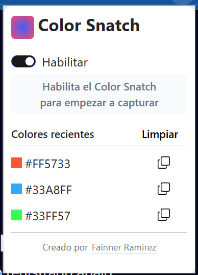

# 🎨 ColorSnatch

ColorSnatch es una extensión de Chrome minimalista y potente que te permite capturar cualquier color de una página web con un solo clic. Perfecta para diseñadores, desarrolladores y entusiastas del diseño web.

## 🚀 Características

- 🖱️ Selector de color en tiempo real
- 📋 Copia automática en formato HEX, RGB o HSL
- 🕵️‍♀️ Historial de colores seleccionados
- 🎯 Precisión de píxel con lupa integrada
- 🌈 Paleta rápida de colores favoritos
- 💾 Exportación de paleta en JSON o CSS variables

## 📦 Instalación

1. Clona este repositorio o descarga el ZIP.
2. Ve a `chrome://extensions/` en tu navegador.
3. Activa el **Modo de desarrollador**.
4. Haz clic en **"Cargar descomprimida"** y selecciona la carpeta del proyecto.
5. ¡Listo! El ícono de ColorSnatch aparecerá en tu barra de herramientas.

## 🛠️ Uso

1. Haz clic en el ícono de ColorSnatch.
2. Selecciona el modo de captura (lupa o selección rápida).
3. Haz clic sobre cualquier elemento de la página para copiar el color al portapapeles.
4. Visualiza el color en el historial o guárdalo en tu paleta.

## Imagenes

